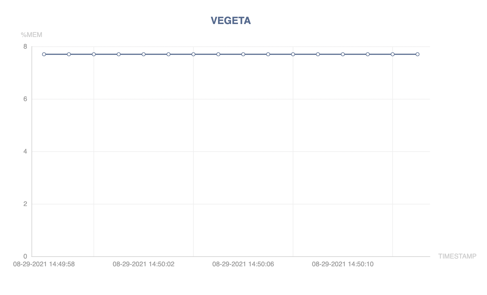

# Vegeta   

Vegeta is a system resource usage tracking tool built to regularly take snapshots of the memory and CPU load of one or more running processes, so as to dynamically build up a profile of their usage of system resources.

<p align="center">  </p>

# Introduction
Vegeta supports multiple modes. You can set the "delay" after which the snapshot of the processes is taken by using the "-d" or "--delay" flag. You can also use the "-m" flag and log only the top m processes with maximum memory usage. In either case, the monitoring of the system resource usage is based on repeated calls to the system command [ps](https://en.wikipedia.org/wiki/Ps_(Unix))

# Prerequisites
Given that vegeta is basically wrapper and parser of "ps" output, naturally the second-most important precondition for vegeta to work on your system is to have the "ps" command available. This is almost certainly true for all POSIX or mostly POSIX-compliant systems, including various flavors of UNIX, Linux's, Apple Mac OS X's etc.

Apart from requiring "ps" or something similar on your system, vegeta has no other dependencies whatsoever: it is a single self-contained pure go pkg and uses nothing but the standard go libraries.

# Usage
You can either download the binary from here [vegeta releases](https://github.com/kartik1998/vegeta/releases) or run the command: 
```
mac: curl -O https://raw.githubusercontent.com/kartik1998/vegeta/master/bin/mac/vegeta
ubuntu: curl -O https://raw.githubusercontent.com/kartik1998/vegeta/master/bin/ubuntu/vegeta
```

* Use the **-d** or **--delay** flag to set delay for memory snapshots (default delay = 5 seconds)
* The **-m** flag to log only those processes consuming **m** memory.
* Use the **-p** flag to specify the process id of the processes you want to trace. To view the processids you can use: `ps aux | sort -rnk 4`
* You can use the **--graph** or **-g** flag to also generate a graph for recording maximum memory consumed by the processes that you are recording as a function of time. The outputs will be written in an html file and you can use the browser to view the graph. 
* Sample usage 1: `./vegeta -d 2 -m 5`
* Sample usage 2: `./vegeta -p 570 -p 20860 -p 568`
* In case you get this error: `exec format error: ./vegeta`, run: `go build vegeta.go` and try again
* Graph generation sample: `./vegeta -d 1 --graph`

